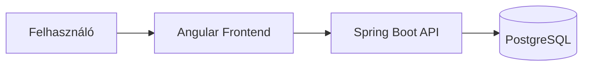
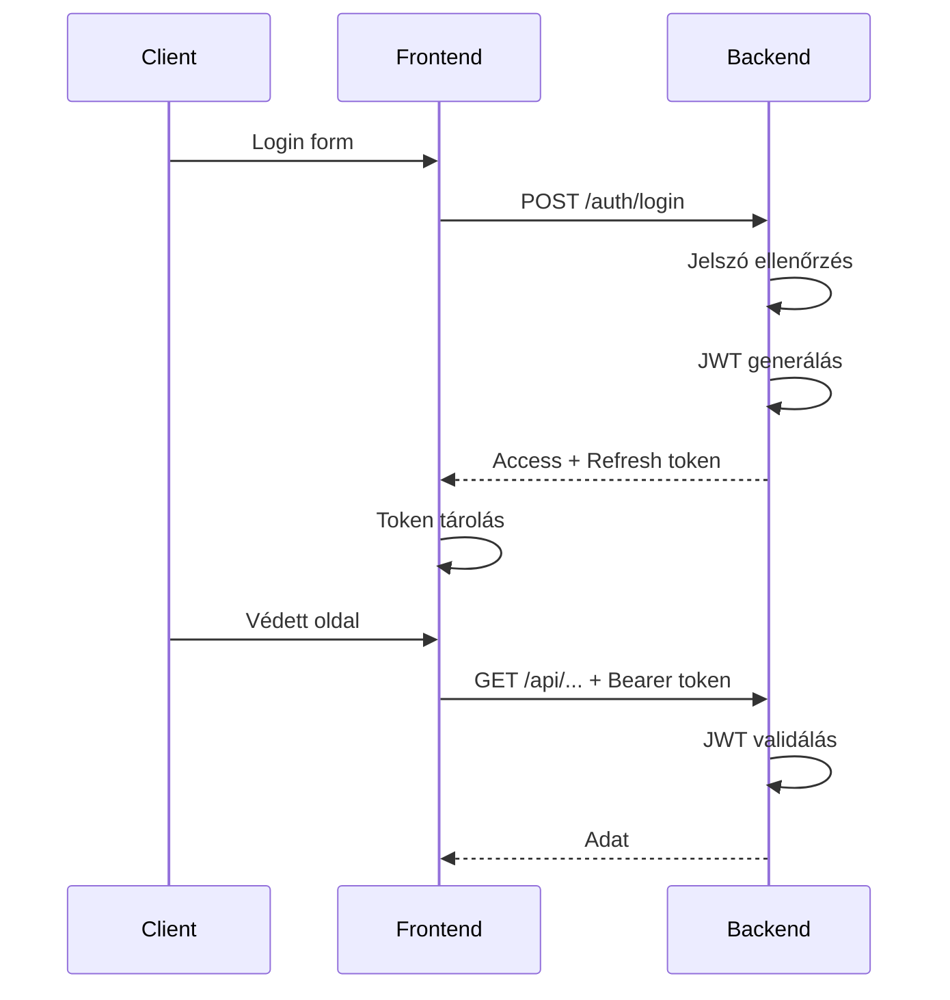

# Architektúra

A StudentSpace egy klasszikus háromrétegű webalkalmazás: Angular frontend, Spring Boot backend, PostgreSQL adatbázis.

## Rendszer áttekintés



A frontend és backend teljesen külön alkalmazásként fut. A kommunikáció REST API-n keresztül történik JSON formátumban.

## Frontend architektúra

Angular 20 alkalmazás SSR (Server-Side Rendering) támogatással. A struktúra:

```
src/app/
├── pages/           # Lazy-loaded oldalak
│   ├── home/
│   ├── login/
│   ├── register/
│   ├── profile/
│   ├── admin/
│   └── selected-profession/
├── components/      # Újrahasználható komponensek
├── services/        # API hívások
├── guards/          # Route védelem
└── layout/          # Közös layout elemek
```

Minden oldal lazy-loaded a gyorsabb initial load érdekében. A routing a `app.routes.ts`-ben van definiálva guard-okkal együtt.

Használt könyvtárak:
- ng-zorro-antd - UI komponensek
- TailwindCSS - styling
- RxJS - reaktív adatkezelés

## Backend architektúra

Spring Boot 4 alkalmazás. A kód modulonként van szervezve:

```
hu.studentspace.main/
├── auth/           # AuthController, AuthService, JwtService
├── users/          # UsersController, UsersService, stb.
├── professions/
├── subject/
├── module/
├── exercises/
├── forum/
├── forumMessages/
├── config/         # SecurityConfiguration, stb.
└── common/         # Közös interfészek
```

Minden modul tartalmazza a saját Entity, Controller, Service és Repository osztályait. Ez nem microservice, de a kód elég moduláris ahhoz, hogy később szét lehessen szedni ha szükséges.

## Biztonsági architektúra

JWT alapú stateless autentikáció.



A security flow:
1. Request bejön
2. JwtAuthenticationFilter ellenőrzi a tokent
3. Ha valid, beállítja a SecurityContext-et
4. Controller kiszolgálja a kérést

A token payloadja:
```json
{
  "sub": "username",
  "iat": 1706450000,
  "exp": 1706450900,
  "roles": ["USER"]
}
```

## Rétegek

### Controller réteg
HTTP request kezelés, input validálás. Nem tartalmaz üzleti logikát.

### Service réteg
Üzleti logika. Itt történik az adatok transzformálása, validálás, stb.

### Repository réteg
Spring Data JPA repository-k. A legtöbb esetben elég a beépített CRUD, custom query-k ritkán kellenek.

## Technológia választások

**Miért Angular?**
TypeScript támogatás, erős typing, enterprise-ready. Az SSR fontos volt az SEO miatt.

**Miért Spring Boot?**
Jól dokumentált, nagy közösség, könnyen integrálható security és JPA.

**Miért PostgreSQL?**
Megbízható, jól kezeli a JSON típusokat (feladatok válaszai), bytea támogatás a fájlokhoz.

**Miért monolitikus?**
Egyszemélyes projekt, nem volt értelme microservice-eket csinálni. A moduláris felépítés miatt később szét lehet bontani.

## Fájlkezelés

A fájlok (képek, PDF-ek) közvetlenül az adatbázisban tárolódnak bytea típusként. Ez egyszerűsíti a deploymentet, nem kell külön storage-ot konfigurálni.

Hátrány: nagyobb DB méret. Ha a projekt nő, érdemes lehet S3-kompatibilis object storage-ra váltani.

## Skálázás

Jelenleg single instance mindkét oldalon, ami elég a szakdolgozathoz. A JWT stateless jellege miatt a backend horizontálisan skálázható lenne, csak load balancer kell elé.

A frontend SSR része Node.js-t igényel, de a static assetek CDN-ről is kiszolgálhatók.
