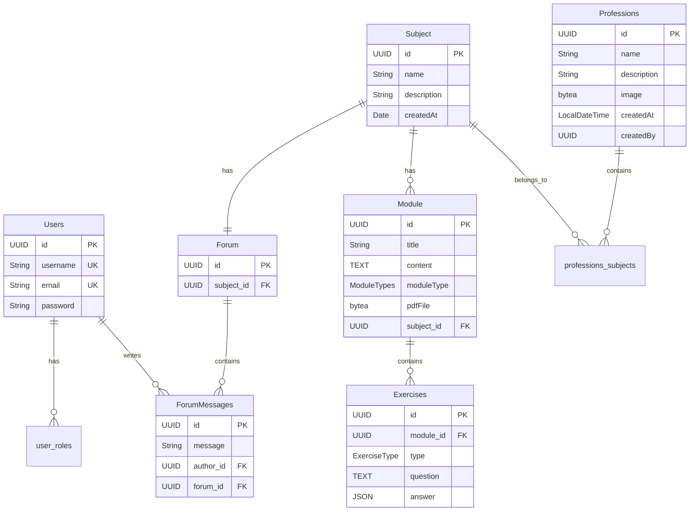

# Adatbázis terv

A StudentSpace PostgreSQL adatbázist használ JPA/Hibernate-tel. Az alkalmazás `hibernate.ddl-auto: update` beállítással fut, így a séma automatikusan frissül az entitások alapján.

## ER Diagram



## Entitások

### Users

Felhasználók táblája. A jelszó BCrypt-tel hashelve tárolódik.

| Mező | Típus | Megjegyzés |
|------|-------|------------|
| id | UUID | generált (gen_random_uuid) |
| username | VARCHAR | egyedi, kötelező |
| email | VARCHAR | egyedi, kötelező |
| password | VARCHAR | hashelt |

A szerepkörök külön `user_roles` táblában vannak (ElementCollection). Lehetséges értékek: USER, ADMIN, SUPERADMIN.

### Professions (Szakmák)

Szakmák, amikhez tantárgyak tartozhatnak. A kép bytea-ként tárolódik közvetlenül az adatbázisban.

| Mező | Típus | Megjegyzés |
|------|-------|------------|
| id | UUID | PK |
| name | VARCHAR | kötelező |
| description | VARCHAR | kötelező |
| image | BYTEA | nullable, szakma képe |

Many-to-Many kapcsolat a Subject-tel a `professions_subjects` kapcsolótáblán keresztül.

### Subject (Tantárgyak)

| Mező | Típus | Megjegyzés |
|------|-------|------------|
| id | UUID | PK |
| name | VARCHAR | |
| description | VARCHAR | |

Kapcsolatok:
- ManyToMany ← Professions
- OneToMany → Module (cascade all, orphan removal)
- OneToOne → Forum

### Module (Modulok)

Tananyag egységek. Három típus van: LESSON (lecke), EXERCISE (gyakorlat), PDF (dokumentum).

| Mező | Típus | Megjegyzés |
|------|-------|------------|
| id | UUID | PK |
| title | VARCHAR | |
| content | TEXT | markdown tartalom |
| moduleType | ENUM | LESSON, EXERCISE, PDF |
| pdfFile | BYTEA | nullable |
| pdfFileName | VARCHAR | eredeti fájlnév |
| subject_id | UUID | FK, cascade delete |

### Exercises (Feladatok)

Modulokhoz tartozó gyakorló feladatok. A válasz JSON formátumban tárolódik, hogy rugalmasan lehessen többféle feladattípust kezelni.

| Mező | Típus | Megjegyzés |
|------|-------|------------|
| id | UUID | PK |
| module_id | UUID | FK |
| type | ENUM | MULTIPLE_CHOICE, TRUE_FALSE, SHORT_ANSWER |
| question | TEXT | kérdés szövege |
| answer | JSON | válaszlehetőségek és helyes válasz |

### Forum és ForumMessages

Minden tantárgyhoz tartozik egy fórum (OneToOne). A ForumMessages tárolja az üzeneteket, amelyek a Users táblával vannak összekapcsolva (author).

## Audit mezők

A legtöbb entitás tartalmaz audit mezőket Spring Data JPA Auditing-gel:

```java
@CreationTimestamp
private LocalDateTime createdAt;

@CreatedBy
private String createdBy;

@UpdateTimestamp
private LocalDateTime updatedAt;

@LastModifiedBy
private String updatedBy;
```

## Bináris adatok

Képek és PDF-ek közvetlenül az adatbázisban tárolódnak bytea típusként:

```java
@JdbcTypeCode(Types.VARBINARY)
@Column(columnDefinition = "bytea")
private byte[] image;
```

Ez egyszerűsíti a deploymentet (nem kell külön file storage), de nagyobb adatbázis méretet eredményez. Később áttérhetünk object storage-ra ha szükséges.

## Kapcsolótáblák

**user_roles** - felhasználó szerepkörök (ElementCollection)

**professions_subjects** - szakma-tantárgy Many-to-Many
